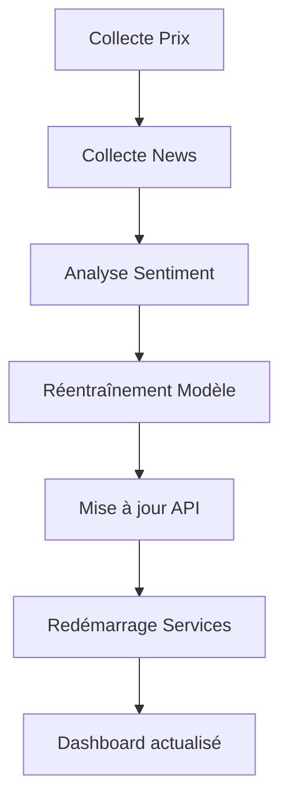

# 🍫 Système de Prédiction des Prix du Cacao - Guide Complet

## 📋 Table des Matières

1. [Vue d'ensemble](#vue-densemble)
2. [Architecture du système](#architecture-du-système)
3. [Prérequis](#prérequis)
4. [Installation](#installation)
5. [Configuration](#configuration)
6. [Utilisation](#utilisation)
7. [Mise à jour quotidienne](#mise-à-jour-quotidienne)
8. [API REST](#api-rest)
9. [Dashboards](#dashboards)
10. [Modèles ML](#modèles-ml)
11. [Base de données](#base-de-données)
12. [Dépannage](#dépannage)
13. [Structure du projet](#structure-du-projet)

---

## 🎯 Vue d'ensemble

Ce système prédit les prix futurs du cacao (1, 7, et 30 jours) en utilisant un modèle hybride combinant:
- **Prophet** (Facebook) pour les tendances temporelles
- **XGBoost** pour les patterns complexes et features engineered
- **FinBERT** pour l'analyse de sentiment des news

### Caractéristiques principales

✅ **Prédictions multi-horizons** : 1 jour, 7 jours, 30 jours  
✅ **Analyse de sentiment** : Intégration des news financières  
✅ **API REST sécurisée** : Authentification JWT  
✅ **Dashboards premium** : Next.js et Streamlit  
✅ **Mise à jour automatisée** : Script batch complet  
✅ **Containerisé** : Docker + Docker Compose  

### Performance actuelle

- **MAPE walk-forward (J+1)**: ~10,3% (validation honnête, référence prod)
- **RMSE**: $362.63
- **MAE**: $259.70
- **Données**: 1,599 points (2020-2026)

---

## 🏗️ Architecture du système

```
┌─────────────────────────────────────────────────────────────┐
│                    UTILISATEUR                               │
└────────────┬────────────────────────────────┬───────────────┘
             │                                 │
             ▼                                 ▼
    ┌────────────────┐              ┌──────────────────┐
    │  Dashboard     │              │   Dashboard      │
    │  Next.js       │              │   Streamlit      │
    │  (Port 3001)   │              │   (Port 8501)    │
    └────────┬───────┘              └────────┬─────────┘
             │                               │
             └───────────────┬───────────────┘
                             │
                             ▼
                    ┌────────────────┐
                    │   API FastAPI  │
                    │   (Port 8000)  │
                    │   + JWT Auth   │
                    └────────┬───────┘
                             │
        ┌────────────────────┼────────────────────┐
        │                    │                    │
        ▼                    ▼                    ▼
┌───────────────┐   ┌────────────────┐   ┌──────────────┐
│   Supabase    │   │  ML Models     │   │   Redis      │
│  (PostgreSQL) │   │  Prophet +     │   │   Cache      │
│               │   │  XGBoost +     │   │  (Optional)  │
│  - Prices     │   │  FinBERT       │   └──────────────┘
│  - News       │   └────────────────┘
│  - Predictions│
└───────────────┘
```

### Composants

1. **API FastAPI** : Endpoint REST pour les prédictions
2. **Modèles ML** : Prophet + XGBoost + FinBERT
3. **Base de données** : Supabase (PostgreSQL)
4. **Cache** : Redis (optionnel)
5. **Dashboards** : Next.js (premium) + Streamlit (simple)
6. **Docker** : Containerisation complète

---

## 📦 Prérequis

### Logiciels requis

- **Docker Desktop** : Version 20.10+
- **Docker Compose** : Version 2.0+
- **Node.js** : Version 18+ (pour le dashboard Next.js)
- **Git** : Pour cloner le repository

### Comptes externes

- **Supabase** : Base de données PostgreSQL cloud
  - URL: `https://supabase.com`
  - Créer un projet gratuit
  - Récupérer l'URL et la clé API

- **NewsAPI** (optionnel) : Pour collecter les news
  - URL: `https://newsapi.org`
  - Clé API gratuite (100 requêtes/jour)

### Configuration système

- **RAM** : Minimum 8 GB (16 GB recommandé)
- **Disque** : 10 GB d'espace libre
- **OS** : Windows 10/11, macOS, ou Linux

---

## 🚀 Installation

### Étape 1: Cloner le repository

```bash
git clone <repository-url>
cd prediction
```

### Étape 2: Configuration de l'environnement

Créer le fichier `.env` à la racine du projet:

```env
# Supabase Configuration
SUPABASE_URL=https://votre-projet.supabase.co
SUPABASE_KEY=votre-cle-api-supabase

# API Configuration
SECRET_KEY=votre-secret-key-jwt-tres-long-et-securise
ALGORITHM=HS256
ACCESS_TOKEN_EXPIRE_MINUTES=60

# NewsAPI Configuration (optionnel)
NEWS_API_KEY=votre-cle-newsapi

# MLflow Configuration (optionnel)
MLFLOW_TRACKING_URI=http://localhost:5000
MLFLOW_REGISTRY_URI=http://localhost:5000

# Redis Configuration (optionnel)
REDIS_HOST=redis
REDIS_PORT=6379
REDIS_DB=0
```

### Étape 3: Initialiser la base de données

```bash
# Se connecter à Supabase et exécuter les scripts SQL dans l'ordre:
# 1. config/database_schema.sql
# 2. config/create_data_collection_tables.sql
# 3. config/create_news_table.sql
```

### Étape 4: Charger les données historiques

```bash
# Copier les fichiers CSV dans le dossier data/
# Puis exécuter:
docker-compose up -d
docker-compose exec -T api python /app/load_historical_data.py
```

### Étape 5: Entraîner le modèle initial

```bash
docker-compose exec -T api python /app/train_hybrid_improved.py
```

### Étape 6: Démarrer tous les services

```bash
# Démarrer l'API
docker-compose up -d

# Démarrer le dashboard Next.js (dans un autre terminal)
cd frontend
npm install
npm run dev -- -p 3001
```

---

## ⚙️ Configuration

### Configuration de l'API

Le fichier `src/api/app.py` contient les chemins vers les modèles:

```python
# Ligne ~260
prophet_path = model_dir / "prophet_improved_YYYYMMDD_HHMMSS.pkl"
xgboost_path = model_dir / "xgboost_improved_YYYYMMDD_HHMMSS.pkl"

# Ligne ~291
model_version="improved_YYYYMMDD_HHMMSS"
```

### Configuration du Dashboard

Le fichier `frontend/src/lib/api.ts` contient l'URL de l'API:

```typescript
const API_BASE_URL = 'http://localhost:8000';
```

### Génération de tokens JWT

```bash
docker-compose exec -T api python /app/generate_jwt_token.py
```

Tokens générés:
- **Utilisateur** (1h) : Accès aux prédictions
- **Admin** (1h) : Accès complet + réentraînement
- **Longue durée** (24h) : Pour le développement
- **Test** (7 jours) : Pour les tests automatisés

---

## 📊 Utilisation

### Démarrage rapide

```bash
# 1. Démarrer l'API
docker-compose up -d

# 2. Vérifier que l'API fonctionne
curl http://localhost:8000/health

# 3. Démarrer le dashboard Next.js
cd frontend
npm run dev -- -p 3001

# 4. Ouvrir dans le navigateur
# http://localhost:3001
```

### Tester l'API avec PowerShell

```powershell
$headers = @{
    "Authorization" = "Bearer VOTRE_TOKEN_ICI"
    "Content-Type" = "application/json"
}

$body = @{
    market = "ICE_NY"
    horizons = @(1, 7, 30)
    include_sentiment = $true
} | ConvertTo-Json

$response = Invoke-RestMethod -Uri "http://localhost:8000/api/v1/predict" -Method Post -Headers $headers -Body $body

$response | ConvertTo-Json -Depth 10
```

### Tester l'API avec curl

```bash
curl -X POST "http://localhost:8000/api/v1/predict" \
  -H "Authorization: Bearer VOTRE_TOKEN_ICI" \
  -H "Content-Type: application/json" \
  -d '{
    "market": "ICE_NY",
    "horizons": [1, 7, 30],
    "include_sentiment": true
  }'
```

---

## 🔄 Mise à jour quotidienne

### Script automatisé (Recommandé)

```bash
# Exécuter le script complet
update_system.bat
```

Ce script effectue automatiquement:
1. ✅ Collecte du prix actuel
2. ✅ Collecte des news + analyse sentiment
3. ✅ Réentraînement du modèle
4. ✅ Mise à jour de l'API
5. ✅ Redémarrage des services

### Mise à jour manuelle

```bash
# 1. Collecter le prix
docker-compose exec -T api python /app/collect_latest_price.py

# 2. Collecter les news
docker-compose exec -T api python /app/collect_news.py

# 3. Réentraîner le modèle
docker-compose exec -T api python /app/train_hybrid_improved.py

# 4. Mettre à jour l'API (modifier src/api/app.py avec les nouveaux chemins)

# 5. Redémarrer l'API
docker-compose restart api
```

---

## 🔌 API REST

### Endpoints disponibles

#### 1. Prédictions

```http
POST /api/v1/predict
Authorization: Bearer <token>
Content-Type: application/json

{
  "market": "ICE_NY",
  "horizons": [1, 7, 30],
  "include_sentiment": true
}
```

**Réponse:**
```json
{
  "predictions": [
    {
      "horizon": 1,
      "price": 4172.83,
      "confidence_interval": [3880.60, 4465.05],
      "confidence_level": 0.95,
      "timestamp": "2026-05-13T01:00:00Z"
    }
  ],
  "model_version": "improved_20260513_003254",
  "sentiment_score": 0.18,
  "market": "ICE_NY"
}
```

#### 2. Performance du modèle

```http
GET /api/v1/performance?start_date=2026-01-01&end_date=2026-05-13
Authorization: Bearer <token>
```

#### 3. Liste des modèles

```http
GET /api/v1/models
Authorization: Bearer <token>
```

#### 4. Health check

```http
GET /health
```

### Codes d'erreur

- **200** : Succès
- **401** : Non authentifié (token invalide/expiré)
- **403** : Non autorisé (permissions insuffisantes)
- **404** : Ressource non trouvée
- **500** : Erreur serveur
- **503** : Service indisponible

---

## 📱 Dashboards

### Dashboard Next.js (Premium)

**URL**: http://localhost:3001

**Fonctionnalités:**
- 🎯 Signal Trading IA (BUY/SELL/HOLD)
- 📊 Graphiques interactifs (Recharts)
- 🔥 Facteurs influents en temps réel
- 🎲 Scénarios futurs (Optimiste/Neutre/Pessimiste)
- 💎 Design premium (Glassmorphism + Animations)
- 📈 Métriques clés (Prix, Sentiment, Volatilité, Modèle)

**Démarrage:**
```bash
cd frontend
npm install
npm run dev -- -p 3001
```

### Dashboard Streamlit (Simple)

**URL**: http://localhost:8501

**Fonctionnalités:**
- 📊 Graphiques de prédictions
- 📰 Analyse de sentiment
- 📈 Métriques de performance
- 🔄 Actualisation en temps réel

**Démarrage:**
```bash
streamlit run dashboard.py --server.port 8501
```

---

## 🤖 Modèles ML

### Architecture hybride

Le système utilise une approche hybride en 3 étapes:

#### 1. Prophet (Baseline)
- Capture les tendances saisonnières
- Gère les jours fériés
- Fournit des prédictions de base

#### 2. XGBoost (Résidus)
- Apprend les patterns complexes
- Utilise des features engineered:
  - Lags (1, 3, 7, 14, 30 jours)
  - Moyennes mobiles (7, 14, 30 jours)
  - Prédictions Prophet
  - Sentiment des news

#### 3. FinBERT (Sentiment)
- Analyse le sentiment des news
- Ajuste les prédictions selon le sentiment
- Pondération: 5% du prix prédit

### Features importantes

Top 5 features (importance):
1. **price_lag_14** : 43.15%
2. **price_lag_7** : 29.25%
3. **price_lag_1** : 8.37%
4. **price_ma_7** : 6.56%
5. **price_lag_3** : 4.12%

### Métriques de performance

- **MAPE walk-forward J+1** : ~10,3% (validation honnête ; holdout legacy ~4,8%)
- **RMSE** : $362.63
- **MAE** : $259.70
- **Couverture IC 95%** : ~95%

### Réentraînement

Le modèle doit être réentraîné:
- **Quotidiennement** : Pour intégrer les nouvelles données
- **Hebdomadairement** : Pour ajuster les hyperparamètres
- **Mensuellement** : Pour réévaluer l'architecture

---

## 💾 Base de données

### Tables Supabase

#### 1. cocoa_prices
```sql
CREATE TABLE cocoa_prices (
    id SERIAL PRIMARY KEY,
    date DATE NOT NULL,
    symbol VARCHAR(10) NOT NULL,
    open DECIMAL(10, 2),
    high DECIMAL(10, 2),
    low DECIMAL(10, 2),
    close DECIMAL(10, 2) NOT NULL,
    volume BIGINT,
    created_at TIMESTAMP DEFAULT NOW()
);
```

#### 2. news_articles
```sql
CREATE TABLE news_articles (
    id SERIAL PRIMARY KEY,
    source VARCHAR(100) NOT NULL,
    title TEXT NOT NULL,
    content TEXT,
    published_at TIMESTAMP NOT NULL,
    url TEXT NOT NULL,
    keywords TEXT[],
    sentiment_score DECIMAL(5, 3),
    is_high_risk BOOLEAN,
    created_at TIMESTAMP DEFAULT NOW()
);
```

#### 3. predictions
```sql
CREATE TABLE predictions (
    id SERIAL PRIMARY KEY,
    horizon INTEGER NOT NULL,
    predicted_price DECIMAL(10, 2) NOT NULL,
    lower_bound DECIMAL(10, 2),
    upper_bound DECIMAL(10, 2),
    confidence_level DECIMAL(3, 2),
    model_version VARCHAR(50),
    baseline_component DECIMAL(10, 2),
    residual_component DECIMAL(10, 2),
    sentiment_component DECIMAL(10, 2),
    created_at TIMESTAMP DEFAULT NOW()
);
```

### Requêtes utiles

```sql
-- Prix récents
SELECT * FROM cocoa_prices 
ORDER BY date DESC 
LIMIT 10;

-- News avec sentiment négatif
SELECT title, sentiment_score, published_at 
FROM news_articles 
WHERE sentiment_score < -0.5 
ORDER BY published_at DESC;

-- Prédictions récentes
SELECT horizon, predicted_price, model_version, created_at 
FROM predictions 
ORDER BY created_at DESC 
LIMIT 10;
```

---

## 🔧 Dépannage

### Problème: API ne démarre pas

**Symptômes:**
```
Error: Failed to initialize Supabase client
```

**Solution:**
1. Vérifier les variables d'environnement dans `.env`
2. Vérifier que Supabase est accessible
3. Vérifier les logs: `docker-compose logs api`

### Problème: Sentiment toujours NULL

**Symptômes:**
```json
{
  "sentiment_score": null
}
```

**Solutions:**
1. Vérifier que des news récentes existent (< 7 jours)
2. Vérifier les logs pour les erreurs de validation
3. Recollecte des news: `docker-compose exec -T api python /app/collect_news.py`

### Problème: Token JWT expiré

**Symptômes:**
```json
{
  "error": 401,
  "message": "Could not validate credentials"
}
```

**Solution:**
```bash
# Générer un nouveau token
docker-compose exec -T api python /app/generate_jwt_token.py
```

### Problème: Modèle non trouvé

**Symptômes:**
```
FileNotFoundError: Prophet model not found
```

**Solution:**
1. Vérifier que les fichiers `.pkl` existent dans `models/`
2. Vérifier les chemins dans `src/api/app.py`
3. Réentraîner: `docker-compose exec -T api python /app/train_hybrid_improved.py`

### Problème: Redis connection refused

**Symptômes:**
```
Error 111 connecting to redis:6379. Connection refused.
```

**Solution:**
- Redis est optionnel, l'API fonctionne sans cache
- Pour activer Redis: décommenter dans `docker-compose.yml`

### Problème: Dashboard Next.js ne démarre pas

**Symptômes:**
```
Error: Cannot find module 'next'
```

**Solution:**
```bash
cd frontend
rm -rf node_modules package-lock.json
npm install
npm run dev -- -p 3001
```

---

## 📁 Structure du projet

```
prediction/
├── .env                          # Variables d'environnement
├── .gitignore                    # Fichiers ignorés par Git
├── docker-compose.yml            # Configuration Docker
├── Dockerfile                    # Image Docker API
├── requirements.txt              # Dépendances Python
├── update_system.bat             # Script de mise à jour automatique
├── README_COMPLET.md             # Ce fichier
│
├── config/                       # Configuration
│   ├── database_schema.sql       # Schéma de base de données
│   ├── create_data_collection_tables.sql
│   ├── create_news_table.sql
│   └── settings.py               # Configuration Python
│
├── data/                         # Données historiques CSV
│   ├── 12-27-1979_11-30_1999.csv
│   ├── 11-08-1999_10-02-2019.csv
│   └── 10-01-2019_05-07_2026.csv
│
├── models/                       # Modèles ML entraînés
│   ├── prophet_improved_YYYYMMDD_HHMMSS.pkl
│   ├── xgboost_improved_YYYYMMDD_HHMMSS.pkl
│   └── model_info_improved_YYYYMMDD_HHMMSS.json
│
├── src/                          # Code source
│   ├── api/                      # API FastAPI
│   │   ├── app.py                # Application principale
│   │   ├── auth.py               # Authentification JWT
│   │   ├── cache.py              # Cache Redis
│   │   └── models.py             # Modèles Pydantic
│   │
│   ├── models/                   # Modèles ML
│   │   ├── price_predictor.py
│   │   ├── improved_price_predictor.py
│   │   ├── time_series_model.py
│   │   ├── ml_model.py
│   │   ├── model_manager.py
│   │   └── data_models.py
│   │
│   ├── nlp/                      # Analyse NLP
│   │   └── nlp_analyzer.py       # FinBERT sentiment
│   │
│   ├── data_collection/          # Collecte de données
│   │   ├── data_collector.py
│   │   ├── multi_source_collector.py
│   │   └── supabase_saver.py
│   │
│   └── monitoring/               # Monitoring
│       ├── performance_monitor.py
│       └── alert_system.py
│
├── frontend/                     # Dashboard Next.js
│   ├── src/
│   │   ├── app/
│   │   │   └── page.tsx          # Page principale
│   │   ├── lib/
│   │   │   ├── api.ts            # Client API
│   │   │   └── utils.ts          # Utilitaires
│   │   └── types/
│   │       └── api.ts            # Types TypeScript
│   ├── package.json
│   └── next.config.mjs
│
├── scripts/                      # Scripts utilitaires
│   ├── collect_latest_price.py   # Collecte prix
│   ├── collect_news.py           # Collecte news
│   ├── train_hybrid_improved.py  # Entraînement
│   ├── load_historical_data.py   # Chargement données
│   └── generate_jwt_token.py     # Génération tokens
│
├── tests/                        # Tests unitaires
│   ├── test_price_predictor.py
│   ├── test_nlp_analyzer.py
│   └── test_api.py
│
└── logs/                         # Logs de l'application
    ├── api_YYYY-MM-DD.log
    └── api_errors_YYYY-MM-DD.log
```

---

## 🎓 Pour un autre agent IA

### Concepts clés à comprendre

1. **Modèle hybride** : Prophet (baseline) + XGBoost (résidus) + FinBERT (sentiment)
2. **Feature engineering** : Lags, moyennes mobiles, prédictions Prophet
3. **Sentiment analysis** : FinBERT sur news financières (7 derniers jours)
4. **API REST** : FastAPI avec authentification JWT
5. **Containerisation** : Docker + Docker Compose pour isolation

### Workflow de mise à jour



### Points d'attention

1. **Timezone** : Toujours utiliser UTC avec timezone-aware datetime
2. **Validation Pydantic** : Les modèles doivent accepter int|str pour les IDs
3. **Sentiment** : Fenêtre de 7 jours, agrégation avec décroissance exponentielle
4. **Modèles** : Chemins hardcodés dans `src/api/app.py` (lignes 260, 291)
5. **Cache Redis** : Optionnel, l'API fonctionne sans

### Commandes essentielles

```bash
# Collecter données
docker-compose exec -T api python /app/collect_latest_price.py
docker-compose exec -T api python /app/collect_news.py

# Entraîner modèle
docker-compose exec -T api python /app/train_hybrid_improved.py

# Redémarrer API
docker-compose restart api

# Générer tokens
docker-compose exec -T api python /app/generate_jwt_token.py

# Logs
docker-compose logs api --tail=100
```

---

## 📞 Support

Pour toute question ou problème:

1. Consulter la section [Dépannage](#dépannage)
2. Vérifier les logs: `docker-compose logs api`
3. Vérifier la santé de l'API: `http://localhost:8000/health`
4. Consulter la documentation Swagger: `http://localhost:8000/docs`

---

## 📄 Licence

Ce projet est sous licence MIT. Voir le fichier `LICENSE` pour plus de détails.

---

## 🙏 Remerciements

- **Prophet** : Facebook Research
- **XGBoost** : DMLC
- **FinBERT** : ProsusAI
- **FastAPI** : Sebastián Ramírez
- **Next.js** : Vercel
- **Supabase** : Supabase Inc.

---

**Dernière mise à jour** : 13 Mai 2026  
**Version** : 2.0.0  
**Auteur** : STE-SCPB / Afrexia
