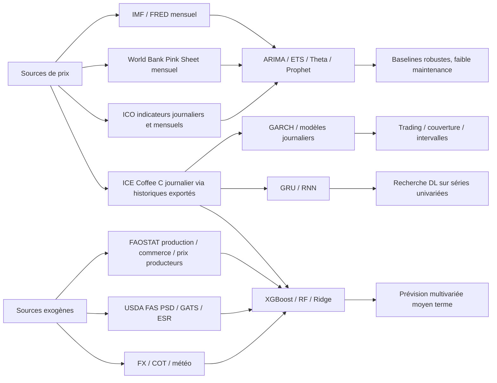
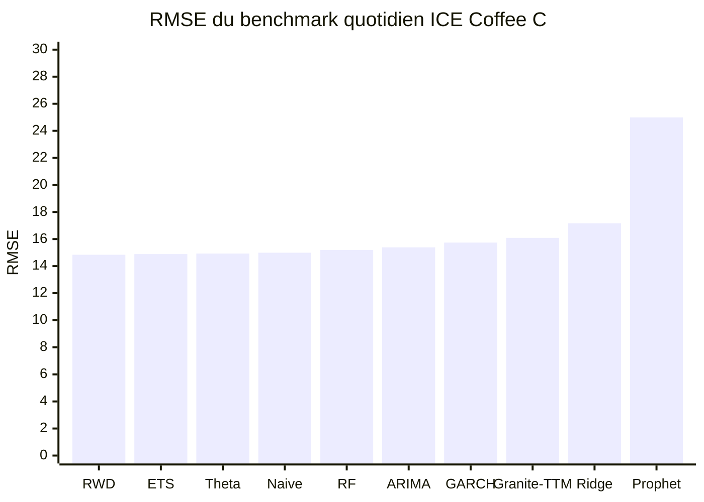
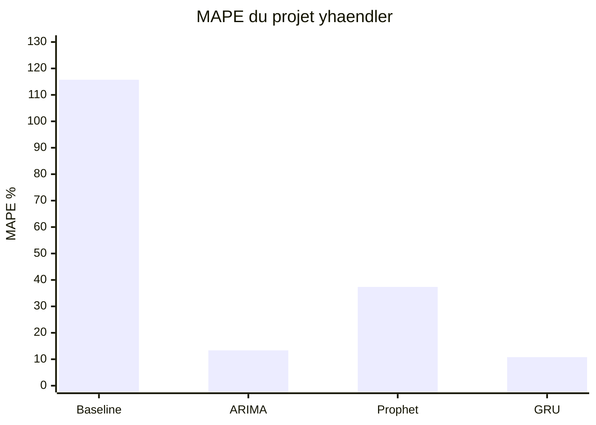

# Modèles open source pour la prédiction du prix du café

## Résumé exécutif

L’écosystème open source réellement **spécifique à la prévision du prix du café** reste fragmenté. Au 30 juin 2026, le dépôt le plus complet et le plus maintenu que j’ai identifié est `F5F0A0/coffee-futures-forecasting-model`, qui combine un déploiement quotidien sur contrats à terme ICE Coffee C avec un benchmark reproductible de 10 modèles sur 32 ans de prix journaliers. C’est aussi le seul projet du corpus qui documente proprement les dépendances, les notebooks, la CLI, les métriques comparatives et un protocole statistique de comparaison inter‑modèles. citeturn22view0turn22view1turn22view2turn18view0turn13view0

Sur le plan de la performance, deux constats dominent. D’abord, sur le benchmark quotidien d’ICE Coffee C du dépôt F5F0A0, les meilleurs scores en RMSE/MAE ne viennent **ni** d’un Transformer **ni** de Prophet, mais de baselines ou semi‑baselines fortes comme `RWD`, `ETS` et `Theta`; ARIMA, GARCH, Granite‑TTM et Prophet sont derrière, Prophet étant nettement le moins performant sur ce benchmark. Ensuite, dans un autre projet centré sur une série quotidienne longue (`yhaendler/Forecasting-Coffee-Prices---Time-Series-Analysis`), un réseau récurrent à base de **GRU** surpasse à la fois ARIMA et Prophet sur le split retenu, avec une MAPE de test de 10,81 % contre 13,36 % pour ARIMA et 37,36 % pour Prophet. Autrement dit, la “meilleure” architecture dépend fortement du **jeu de données**, de la **fréquence**, et surtout du **protocole d’évaluation**. citeturn28view0turn39view2turn39view4

Pour un usage opérationnel, les recommandations sont assez nettes. Si l’objectif est un **forecast quotidien de marché** avec intervalles de prédiction et maintenance sérieuse, le dépôt F5F0A0 est le meilleur point de départ. Si l’on dispose de variables exogènes hebdomadaires (FX, COT, météo) et qu’on vise une projection à moyen terme, `CalvinOK/C-MarketFutures` propose une voie pragmatique avec **XGBoost**, mais sans métriques détaillées publiées dans le README. Si l’on veut un projet pédagogique ou de recherche sur séries mensuelles ou journalières, les dépôts `yhaendler`, `jihli`, `rileynwong` et `jgroth1` sont utiles, mais ils souffrent souvent d’un manque de licence explicite, d’environnements non figés et d’évaluations incomplètes. citeturn34view0turn34view1turn34view4turn39view4turn40view0turn12search2turn21view4

Enfin, la disponibilité des données est un facteur limitant majeur. Les meilleures sources “ouvertes” ou quasi ouvertes pour les **prix** eux‑mêmes sont aujourd’hui l’**IMF Primary Commodity Markets**, sa republication via **FRED**, la **Pink Sheet** de la Banque mondiale, et dans une moindre mesure les publications de l’**ICO**. Pour les variables exogènes, **FAOSTAT** et **USDA FAS Open Data** sont précieux, mais ils servent surtout à enrichir les modèles multivariés, pas à fournir des cotations de marché quotidiennes prêtes à l’emploi. citeturn51search3turn51search2turn51search0turn48search4turn48search10turn48search2turn50search0turn50search13turn49search0turn49search1

## Méthode et périmètre

La recherche a été conduite en privilégiant les sources suivantes, par ordre de confiance pratique : dépôts GitHub publics directement inspectables, documentation officielle des fournisseurs de données, puis articles académiques ou prépublications quand ils apportaient des métriques ou des protocoles d’évaluation utiles. Le périmètre retenu mélange donc des dépôts explicitement dédiés au café et, quand ils étaient particulièrement éclairants, des articles académiques sur la prévision du prix du café sans dépôt de code bien maintenu. citeturn22view0turn39view4turn16search3turn16search6turn49search0turn48search0

Le corpus open source retenu couvre sept projets distincts. Il inclut des approches univariées classiques, des modèles séquentiels GRU, des hybridations régression + ARIMA, un pipeline GARCH de volatilité/prix, une régression linéaire packagée en application full‑stack, et un pipeline XGBoost multivarié hebdomadaire avec variables exogènes. Dans l’échantillon retenu, la seule présence explicite d’un modèle de type Transformer/foundation model est **Granite‑TTM** comme comparateur dans le benchmark F5F0A0, et non comme projet café autonome et maintenu. citeturn39view4turn21view4turn22view1turn18view0

Le diagramme ci‑dessous résume les relations entre familles de modèles, jeux de données et usages.



Ce schéma synthétise les correspondances observées dans les dépôts et jeux de données du corpus. Les séries quotidiennes de futures ICE favorisent les approches de marché et de backtest journalier, alors que l’IMF/FRED, la Banque mondiale et l’ICO alimentent plus naturellement des modèles mensuels ou des couches de validation macro. citeturn22view0turn51search2turn51search0turn48search4turn49search0turn49search1

## Cartographie des projets open source

Le tableau suivant regroupe les projets les plus pertinents identifiés, avec les champs demandés. Quand une information n’apparaît pas dans les vues consultées, je l’indique explicitement comme **non spécifiée**.

| Projet | Dépôt | Licence | Langage | Dépendances visibles | Dernière mise à jour visible | Taille du repo | README / doc | Source |
|---|---|---:|---|---|---|---|---|---|
| **F5F0A0 / coffee-futures-forecasting-model** | `github.com/F5F0A0/coffee-futures-forecasting-model` | MIT | Jupyter Notebook 98,6 %, Python 1,4 % | `numpy`, `pandas`, `scipy`, `scikit-learn`, `matplotlib`, `xlrd`, `statsforecast`, `statsmodels`, `arch`, `prophet`, `yfinance`, `torch`, `granite-tsfm`, `ordpy`, `jupyter`, `tqdm` | 29 juin 2026 | Non spécifiée au niveau dépôt dans la vue consultée | **Très bonne** : README structuré, notebooks ordonnés, scripts CLI, layout clair, benchmark + déploiement | citeturn22view0turn18view0turn13view0turn33view5 |
| **yhaendler / Forecasting-Coffee-Prices---Time-Series-Analysis** | `github.com/yhaendler/Forecasting-Coffee-Prices---Time-Series-Analysis` | Non spécifiée | Jupyter Notebook 96,4 %, R 2,8 % | Notebooks Python + scripts R Prophet; environnement exact non figé dans la vue consultée | Non spécifiée dans la vue consultée | Non spécifiée | **Bonne** : README détaillé avec données, modèles, métriques, structure du repo | citeturn39view4turn33view0turn32view2 |
| **CalvinOK / C-MarketFutures** | `github.com/CalvinOK/C-MarketFutures` | Non spécifiée | Python 66,7 %, TypeScript 32,9 % | API légère: `Flask`, `requests`, `beautifulsoup4`, `lxml`, `playwright`; offline: `numpy`, `pandas`, `requests`, `xgboost`, `matplotlib` | 27 mai 2026 | Non spécifiée | **Bonne** : README opératoire, besoins runtime/offline séparés, commandes de lancement | citeturn34view3turn37view0turn38view0turn14view0turn33view4turn32view5 |
| **bhavyamuni / coffee-price-app** | `github.com/bhavyamuni/coffee-price-app` | Non spécifiée | Jupyter Notebook 55,8 %, JavaScript 18,3 %, Python 17,3 %, HTML/CSS/Mako/Dockerfile | `fastapi`, `FastAPI-SQLAlchemy`, `pandas`, `numpy`, `scikit-learn`, `matplotlib`, `psycopg2`, `SQLAlchemy`, `uvicorn`, `alembic`; `docker-compose` | 31 août 2022 | Non spécifiée | **Moyenne** : README court, lancement Docker explicite, mais peu de détails méthodologiques | citeturn19view0turn18view2turn14view1turn33view3turn32view4 |
| **rileynwong / forecasting-coffee-prices** | `github.com/rileynwong/forecasting-coffee-prices` | Non spécifiée | Jupyter Notebook 100 % | `fbprophet`, `pystan`, `tabula`, `numpy`, `pandas`, `matplotlib`, etc. | 19 mars 2019 | Non spécifiée | **Moyenne à bonne** : setup conda/pip, liens NBViewer, notebook de parsing PDF et notebook de forecast | citeturn12search2turn17view0turn14view3turn33view2turn32view0 |
| **jihli / Time-Series-Analysis-Coffee-Price-Prediction-Between-2000-and-2022** | `github.com/jihli/Time-Series-Analysis-Coffee-Price-Prediction-Between-2000-and-2022` | Non spécifiée | Jupyter Notebook 100 % | Non spécifiées dans la vue consultée | 8 juin 2022 | Non spécifiée | **Faible à moyenne** : README très succinct, un notebook central, peu d’éléments d’environnement | citeturn40view0turn14view4turn33view1turn32view1 |
| **jgroth1 / Project_1_Coffee_Price_Predictors** | `github.com/jgroth1/Project_1_Coffee_Price_Predictors` | Non spécifiée | Jupyter Notebook 100 % | Non spécifiées dans la vue consultée | 13 juillet 2018 | Non spécifiée | **Moyenne** : README riche en hypothèses et résultats, mais industrialisation faible | citeturn21view4turn14view2turn11view3turn32view3 |

Au-delà de cette cartographie, les différences de **qualité documentaire** sont importantes. F5F0A0 est manifestement conçu pour être relancé, audité et comparé; `yhaendler` est solide pour la compréhension méthodologique; `rileynwong` et `CalvinOK` sont assez pratiques pour redémarrer vite; `jihli`, `jgroth1` et `bhavyamuni` sont plus proches de projets de cours ou de prototypage que de bases de production. citeturn22view0turn39view4turn12search2turn34view3turn40view0turn21view4turn33view3

Sur le plan technique, chaque projet se positionne différemment :

| Projet | Type de modèle | Architecture / logique | Entrées → sorties | Prétraitement / features | Horizon / fréquence | Performances rapportées |
|---|---|---|---|---|---|---|
| **F5F0A0** | GARCH(1,1)-t en production; benchmark multi‑modèles | GARCH sur log‑returns pour le live forecast; benchmark 10 modèles avec API commune | `ds,y` quotidiens → trajectoire 63 jours ouvrés + intervalles 80/95 % | ajout des nouveaux closes Yahoo `KC=F`, fitting sur rendements logarithmiques; benchmark quotidien sur 8 104 closes | **63 business days**, fréquence **journalière** | Voir tableau comparatif benchmark ci‑dessous | citeturn22view0turn22view4turn22view5 |
| **yhaendler** | ARIMA, Prophet, RNN-GRU | ARIMA(3,0,2); Prophet (`changepoint prior scale=0.1`, `seasonality prior scale=0.01`); GRU 100 → Dropout 0,2 → GRU 50 → Dropout 0,2 → Dense 10 → Dense 1, 54 221 paramètres | Série journalière univariée → point forecasts sur période test | Données quotidiennes 1973‑2020; split avec **259 jours** de test; fenêtres de **10** valeurs pour le GRU | Test sur **259 jours**, fréquence **journalière** | Baseline MAPE 115,73 %; ARIMA MAPE test 13,36 %; Prophet MAPE test 37,36 %; GRU MAPE test 10,81 % | citeturn39view2turn39view4 |
| **CalvinOK** | XGBoost multivarié | `XGBRegressor` avec walk‑forward backtest et projection récursive | données hebdo prix + exogènes → projection 26 semaines | date/target inférées; lag features, rolling stats, returns, calendar features; exogènes FX/COT/weather; maintien des dernières valeurs futures si scénario absent | **26 semaines**, fréquence **hebdomadaire** | README mentionne backtest, mais **pas de RMSE/MAE chiffrés** dans la vue consultée | citeturn34view0turn34view1turn34view2 |
| **bhavyamuni** | Régression linéaire | `LinearRegression()` de scikit‑learn | `Open, High, Low` → `Close` | retrait de `Currency`, split aléatoire 80/20; corrélation explorée | même journée / fréquence **journalière** | **Aucune métrique chiffrée visible** dans la vue consultée | citeturn41view0turn43view0 |
| **rileynwong** | Prophet | forecast Prophet appliqué aux prix moyens mensuels kényans | PDF NCE → CSV mensuel → forecasts AA/AB/C | scraping PDF via Tabula puis agrégation mensuelle des prix moyens | session **2018‑2019**, fréquence **mensuelle** | **Aucune métrique normalisée visible** dans le README consulté | citeturn12search2turn17view0 |
| **jihli** | ARIMA | pipeline notebook: EDA → resampling mensuel → décomposition → ADF/ACF/PACF → ARIMA | séries journalières → série mensuelle → forecast ARIMA | resampling daily→monthly; ADF et ACF/PACF sur la série mensuelle | horizon **non spécifié**, fréquence **mensuelle** après agrégation | **Aucune métrique visible** dans le README consulté | citeturn40view0turn40view5 |
| **jgroth1** | Ridge, Lasso, Lasso dé‑outlierisé, hybride Lasso+ARIMA | régression sur variables exogènes + couche ARIMA finale | météo + production + import/export + saisonnalité → prix commodity coffee | hypothèses explicites sur météo, production, commerce; décomposition saisonnière et scaling évoqués | fréquence exacte **non spécifiée clairement** | Ridge test adj. R² = -8,7, MSE 1353,5, MAE 31,02; Lasso test adj. R² = 0,371, MSE 87,78, MAE 7,165 | citeturn21view4turn21view1 |

Deux lectures critiques s’imposent. D’une part, certains dépôts ne font pas de “forecast ex ante” au sens strict : `bhavyamuni` prédit le **Close** à partir de `Open/High/Low`, ce qui est plus proche d’une approximation de clôture intra‑journalière ou d’une démonstration de ML tabulaire que d’une vraie prévision multi‑horizon. D’autre part, les projets les mieux armés pour la production sont aussi ceux qui publient les protocoles les plus sévères; cela tend à réduire l’écart apparent entre modèles complexes et baselines robustes. citeturn41view0turn22view2turn28view0

## Performances rapportées

Le benchmark le plus exploitable du corpus est celui de F5F0A0. Sur 60 origines de backtest, les scores publiés dans `final_leaderboard_60.csv` donnent l’ordre suivant en RMSE : `RWD` 14,84, `ETS` 14,89, `Theta` 14,93, `Naive` 14,99, `RF` 15,19, `ARIMA` 15,39, `GARCH` 15,74, `Granite-TTM` 16,09, `Ridge` 17,16 et `Prophet` 24,99. En MAE, l’ordre est similaire, avec `RWD` à 12,79 et `Prophet` à 22,69. Le dépôt précise en outre qu’un **Model Confidence Set** conclut que neuf modèles sur dix sont conjointement indistinguables à \(\alpha=0{,}10\), ce qui plaide pour une lecture prudente des écarts de métriques trop fins. citeturn28view0turn22view2



Les valeurs du graphique proviennent directement du leaderboard 60 origines du dépôt F5F0A0. Le point méthodologiquement intéressant est qu’un foundation model temporel comme **Granite‑TTM** ne domine pas les meilleurs baselines sur cette tâche spécifique, ce qui rappelle qu’en prévision financière mono‑série, la fraîcheur des données, le protocole de backtest et la stabilité de la cible pèsent souvent plus que la sophistication nominale du modèle. citeturn28view0turn22view1turn18view0

Le second ensemble de résultats comparables vient du capstone `yhaendler`. Sur une série quotidienne 1973‑2020 avec les **259 derniers jours** en test, la baseline naïve affiche une MAPE de 115,73 %, ARIMA(3,0,2) une MAPE de test de 13,36 % et une MSE de test de 0,072, Prophet une MAPE de test de 37,36 % et une MSE de 0,317, et le réseau GRU une MAPE de test de 10,81 % pour une MSE de 0,051. Le README fournit aussi la structure du GRU, le nombre de paramètres, les fenêtres d’entrée et la courbe training/validation. citeturn39view2turn39view4



Cette comparaison n’est pas strictement transposable au benchmark F5F0A0, parce que les séries, les horizons, les prétraitements et les règles de backtest diffèrent. Elle indique néanmoins qu’un RNN/GRU bien calibré peut gagner contre ARIMA et Prophet sur une longue série univariée quotidienne de prix du café. Elle ne suffit pas, en revanche, à conclure qu’un modèle profond l’emporte “en général” sur les meilleures baselines de marché. citeturn39view2turn28view0turn22view2

Les autres résultats publiés sont moins homogènes mais restent utiles. Le projet `jgroth1` rapporte, pour ses modèles exogènes, un `Ridge` avec un adjusted \(R^2\) test de \(-8{,}7\), un MSE de 1353,5 et un MAE de 31,02; un `Lasso` avec adjusted \(R^2\) test de 0,371, MSE de 87,78 et MAE de 7,165; et un `Deoutliered Lasso` à MAE 12,84. Le README présente aussi un “Lasso Regression + ARIMA” comme modèle final, mais sans protocole comparatif détaillé ni amélioration chiffrée robuste au-delà du MAE affiché. citeturn21view1turn21view5

Côté littérature académique, l’article **Time Series Analysis of Global Prices of Coffee** constitue un repère utile pour un ARIMA mensuel proprement documenté : il retient un **ARIMA(0,1,2)** sur le prix mondial mensuel du café Arabica “Other Mild” de janvier 1990 à juillet 2023, avec AIC 3024,65, RMSE 10,3222, MAE 7,121429 et MAPE 5,13002. L’article conclut que le modèle s’ajuste correctement au regard du test de Ljung‑Box rapporté. citeturn16search6turn16search3

À l’inverse, plusieurs dépôts du corpus ne publient **pas** les métriques demandées sous une forme exploitable. C’est le cas de `jihli`, `rileynwong`, `CalvinOK/C-MarketFutures` et `bhavyamuni/coffee-price-app` dans les vues accessibles ici : le modèle, la fréquence et parfois le protocole sont visibles, mais pas un tableau de RMSE/MAE/MAPE/R² suffisamment net pour un benchmark rigoureux. Ce manque de reporting est lui‑même un critère de sélection important si l’objectif est la reprise industrielle ou la comparaison scientifique. citeturn40view0turn12search2turn34view0turn41view0

## Données et API ouvertes

Le meilleur compromis entre ouverture, stabilité et utilité pour la modélisation est aujourd’hui un empilement de sources plutôt qu’une source unique. Pour les **prix mondiaux mensuels**, l’IMF Primary Commodity Markets et sa republication FRED sont les plus pratiques. Pour la **validation macro** et les fichiers de travail simples à télécharger, la Pink Sheet de la Banque mondiale reste très utile. Pour les **fondamentaux** pays/année, FAOSTAT et USDA FAS complètent bien le tableau. Pour des **prix café officiels** plus proches du marché, l’ICO est précieux, mais l’ouverture des fichiers est partielle et inégale. citeturn51search3turn51search2turn51search0turn48search4turn48search10turn48search2turn50search0turn50search13turn49search0turn49search1

| Source | Type | Période / fréquence | Format / accès | Licence / conditions | Qualité pratique | Commentaire |
|---|---|---|---|---|---|---|
| **FRED – PCOFFOTMUSDM** | Prix mondial café “Other Mild Arabica” | Jan. 1992 → mai 2026, **mensuel** | page web + API FRED | FRED API Terms of Use; clé API requise pour l’API | **Très élevée** | Série simple, propre, versionnée, idéale pour ARIMA/Prophet de base | citeturn51search2turn47search1turn47search8 |
| **FRED – PCOFFROBUSDM** | Prix mondial café robusta | Jan. 1992 → mai 2026, **mensuel** | page web + API FRED | FRED API Terms of Use | **Très élevée** | Bonne série complémentaire pour modèles Arabica/Robusta ou spreads | citeturn51search0turn47search1turn47search8 |
| **IMF Primary Commodity Markets** | Base source des prix matières premières | depuis **1980**, **mensuel** | base + Excel/CSV | conditions du site IMF; licence ouverte explicite non visible sur la page consultée | **Très élevée** | Référence primaire des séries reprises par FRED; prix nominaux USD, moyennes de période | citeturn48search0turn48search3turn51search3 |
| **Banque mondiale – Pink Sheet** | Prix mondiaux de commodités | mise à jour **mensuelle**; profondeur historique dépend du fichier | PDF + documents téléchargeables | données ouvertes Banque mondiale, usage gratuit avec restrictions minimales | **Élevée** | Très utile pour pipelines macro et contrôles croisés; pas une API ciblée “café” | citeturn48search4turn48search10turn48search1 |
| **FAOSTAT API** | Production, commerce, prix producteurs, variables exogènes | couverture multi‑pays; souvent **annuelle** | API + JSON/CSV | accès gratuit FAO | **Élevée** pour exogènes, **moyenne** pour prix de marché | Excellent pour variables structurelles; moins adapté aux prix spot/futures journaliers | citeturn50search11turn48search2turn47search2 |
| **USDA FAS Open Data / PSD** | Offre/demande, commerce, fondamentaux agricoles | séries par campagne / publication | API + fichiers téléchargeables | public data portal; conditions détaillées non visibles dans l’extrait consulté | **Élevée** pour exogènes | Très bon complément pour modèles multivariés; ce n’est pas une source de cotation café tick‑par‑tick | citeturn50search0turn50search2turn50search13 |
| **ICO Public Market Information / Historical Data** | Composite Indicator Price et groupes | quotidien / mensuel selon document | PDF, Excel sur demande ou téléchargement partiel | données gratuites pour certains profils; autres cas parfois sur devis; mention de la source demandée | **Élevée**, mais ouverture **partielle** | Source officielle métier; excellente pour validation café, moins commode pour automatisation ouverte | citeturn49search0turn49search1turn49search2turn49search9 |
| **Nairobi Coffee Exchange via repo rileynwong** | Prix kényans AA/AB/C dérivés de PDF | 2014‑2018, **mensuel** après parsing | CSV dans dépôt + PDF source | licence non spécifiée | **Moyenne** | Bon cas d’usage local; intéressant pour forecasting régional, moins pour benchmark global | citeturn12search2turn31view0 |
| **Macrotrends / Kaggle copies communautaires** | Séries journalières utilisées dans des projets | variable selon copie | CSV / dataset communautaire | licence souvent non claire | **Moyenne à faible** | utiles pour prototypage, moins recommandés comme base “source of truth” | citeturn39view4turn40view0 |

En pratique, si l’objectif est un pipeline propre et reproductible, je recommande de bâtir la couche “prix” sur **IMF/FRED ou Pink Sheet**, puis d’ajouter **FAOSTAT / USDA FAS** pour les features structurelles, et enfin d’utiliser l’**ICO** comme source de validation métier quand l’accès est possible. La plupart des projets open source trouvés n’ont pas de pipeline de données suffisamment robuste pour se passer de cette recomposition. citeturn51search3turn51search2turn48search4turn48search2turn50search0turn49search0

## Reproduction et déploiement

Le niveau de reproductibilité varie énormément. Le dépôt F5F0A0 est de loin le plus soigné : il précise Python 3.11, l’installation editable via `pip install -e .`, l’existence d’un `requirements.lock.txt`, un notebook principal de benchmark, un script CLI équivalent et un script de forecast quotidien. Le README indique explicitement que `scripts/run_forecast.py` recharge l’historique, récupère les nouveaux closes `KC=F` via Yahoo Finance, ajuste le GARCH(1,1)-t sur les log‑returns et écrit à la fois une image et un CSV de forecast. citeturn22view0turn18view0

Un cycle de reproduction réaliste pour ce dépôt ressemble à ceci :

```bash
git clone https://github.com/F5F0A0/coffee-futures-forecasting-model
cd coffee-futures-forecasting-model
python -m venv .venv
source .venv/bin/activate
pip install -e .
python scripts/run_forecast.py
```

Ces commandes reprennent le parcours documenté dans le README. Pour refaire le benchmark complet, il faut enchaîner le notebook `01_backtest_run.ipynb` ou la CLI `scripts/run_backtest.py`; pour les comparaisons statistiques, `02_backtest_stats.ipynb` applique notamment Diebold‑Mariano et Model Confidence Set. citeturn22view0turn22view2

Le projet `rileynwong` est le plus simple parmi les dépôts pédagogiques à remettre en route, grâce à ses consignes conda/pip et à son `requirements.txt` explicite. La reproduction suit le schéma ci‑dessous :

```bash
conda create -n coffee_env python=3
conda activate coffee_env
conda install gcc
conda install -c conda-forge fbprophet
pip install -r requirements.txt
```

Ensuite, on lance d’abord `PDF_to_CSV.ipynb` pour parser et nettoyer les PDF, puis `Predicting_Coffee_Prices.ipynb` pour la partie Prophet. Cette approche est utile si l’on veut un pipeline régional léger, mais elle repose sur un stack `fbprophet/pystan` ancien et donc parfois fragile à réinstaller sur des environnements récents. citeturn12search2turn17view0

`CalvinOK/C-MarketFutures` est intéressant pour le déploiement parce qu’il sépare un runtime API léger et un environnement offline plus lourd pour l’entraînement. Le README expose à la fois la logique features/backtest et la commande de projection hebdomadaire :

```bash
python coffee_xgboost_projection.py \
  --input data/kc_weekly_with_fx_cot_weather_overlap_only.csv \
  --target settlement \
  --date-col friday_week \
  --horizon-weeks 26 \
  --history-weeks 104 \
  --outdir outputs
```

Les sorties prévues sont un CSV de backtest, un CSV de projection 6 mois, un PNG et un CSV d’importance des variables. La contrainte principale est la construction des données d’entrée hebdomadaires enrichies (`FX`, `COT`, météo), sans laquelle le dépôt perd une partie de sa valeur. citeturn34view0turn34view3turn37view0turn38view0

`bhavyamuni/coffee-price-app` est le seul dépôt du corpus orienté **application** dès le départ. Le README se résume presque à `docker compose up`, et le dépôt contient à la fois `model.ipynb`, `model.pkl`, un backend FastAPI, un front‑end, un `docker-compose.yml` et la couche SQLAlchemy/PostgreSQL. C’est le plus rapide à déployer localement, mais son modèle publié est une simple régression linéaire sur `Open/High/Low → Close`, ce qui limite fortement sa portée si l’on parle de vraie prévision de marché. citeturn33view3turn18view3turn18view4turn41view0

Pour les exigences matérielles, un CPU moderne suffit dans presque tous les cas du corpus. C’est une **inférence pratique** fondée sur la taille modérée des modèles publiés, l’absence de gros checkpoints et la nature des dépendances. Même le GRU du projet `yhaendler` ne compte que 54 221 paramètres et a été entraîné sur 30 époques, ce qui reste très léger comparé aux standards actuels du deep learning. Le seul cas où un GPU peut aider est l’exploration de variants deep/foundation model hors du périmètre strict du dépôt F5F0A0, qui n’expose pas de checkpoint coffee‑spécifique prêt à l’emploi. citeturn39view2turn18view0

## Recommandations et limites

Si votre priorité est la **précision robuste avec faible dette technique**, il faut commencer par des baselines fortes : `Naive`, `RWD`, `ETS`, `Theta`, puis ARIMA. Le benchmark F5F0A0 montre qu’elles peuvent rester au niveau, voire devant, des modèles perçus comme plus “modernes”, y compris Prophet et Granite‑TTM, sur des prix journaliers ICE Coffee C. Pour une équipe qui doit maintenir un système durable avec peu de personnel, cette piste est objectivement la plus rationnelle. citeturn28view0turn22view2

Si votre priorité est un **usage marché / risk management** avec bandes d’incertitude, le meilleur choix du corpus est le pipeline **GARCH(1,1)-t** de F5F0A0. Il produit un horizon de 63 jours ouvrés avec intervalles 80 % et 95 %, s’actualise quotidiennement, et son dépôt contient déjà les éléments de backtest, de diagnostic et d’archivage nécessaires. Ce n’est pas forcément le champion absolu du RMSE dans le benchmark, mais c’est le plus cohérent pour un usage “trading / couverture / monitoring” parce qu’il combine forecast et quantification explicite de l’incertitude. citeturn22view0turn22view4turn22view5

Si vous disposez de **données exogènes** crédibles — météo, change, COT, production, exportations — un modèle tabulaire comme **XGBoost** devient très pertinent. `CalvinOK/C-MarketFutures` et, dans un esprit plus académique, `jgroth1/Project_1_Coffee_Price_Predictors`, montrent bien pourquoi : le café réagit à des facteurs climatiques, logistiques et commerciaux qui ne sont pas toujours visibles dans la seule série de prix. En revanche, la qualité finale dépendra plus de l’ingénierie des features et du scénario futur des variables exogènes que du modèle lui‑même. citeturn34view0turn34view3turn21view4

Si vous privilégiez la **recherche exploratoire deep learning**, le projet `yhaendler` est le plus utile du corpus, car il documente correctement son architecture GRU, sa fenêtre de lookback, ses paramètres et ses scores. Mais il faut garder en tête deux limites : d’abord, le protocole est un split unique sur les 259 derniers jours et non un walk‑forward long; ensuite, le modèle reste univariate, donc aveugle aux chocs exogènes (climat, change, politique commerciale, arbitrage Arabica/Robusta, etc.). Ses bons résultats doivent donc être vus comme une preuve de potentiel, pas comme un verdict universel. citeturn39view2

Les risques structurels sont élevés pour **tous** les modèles café. La série est affectée par la saisonnalité, les ruptures structurelles, les épisodes climatiques extrêmes, les problèmes logistiques, les arbitrages entre marchés, les effets de change et les politiques commerciales. L’article académique sur ARIMA(0,1,2) sur données mensuelles rappelle lui‑même que les fluctuations du café reflètent de nombreux facteurs interreliés, dont l’offre/demande, les conditions économiques, les taux de change et les politiques de commerce. C’est précisément pourquoi un très bon RMSE in‑sample ou sur un split historique ne garantit pas une robustesse en régime de choc. citeturn16search6turn16search3

Il faut aussi signaler plusieurs limites non triviales du corpus open source trouvé. La première est **juridique** : la majorité des dépôts retenus n’affichent pas de licence explicite, ce qui complique la réutilisation commerciale. La deuxième est **méthodologique** : plusieurs dépôts ne publient pas de métriques complètes ni de protocole de backtest reproductible. La troisième est **data-centric** : beaucoup s’appuient sur des jeux de données communautaires ou des extractions ad hoc plutôt que sur une source de vérité officielle et versionnée. En production, ces trois faiblesses peuvent coûter plus cher que quelques dixièmes de RMSE. citeturn32view2turn32view1turn32view0turn32view3turn32view4turn32view5

Le tableau ci‑dessous synthétise le choix de modèle selon le cas d’usage.

| Cas d’usage | Modèle recommandé | Pourquoi | À éviter si… |
|---|---|---|---|
| Forecast quotidien simple et maintenable | `ETS` / `Theta` / `ARIMA` / `RWD` | très bons baselines, faible coût de maintenance, backtests plus lisibles | vous avez beaucoup d’exogènes de qualité non exploitées | citeturn28view0turn22view2 |
| Couverture / trading avec intervalles | **GARCH(1,1)-t** type F5F0A0 | intervalles 80/95 %, pipeline quotidien, benchmark et diagnostics disponibles | vous voulez surtout expliquer les drivers fondamentaux | citeturn22view0turn22view4turn22view5 |
| Projection moyen terme avec exogènes hebdo | **XGBoost** type C‑MarketFutures | lag/rolling/calendar + météo/FX/COT, bon compromis précision/latence | vos exogènes futurs sont trop incertains ou indisponibles | citeturn34view0turn34view1turn34view3 |
| Recherche DL univariée | **GRU** type yhaendler | bonne MAPE sur split publié, architecture légère | vous avez besoin d’explicabilité réglementaire ou d’un backtest multi‑fenêtres rigoureux | citeturn39view2 |
| Prototype pédagogique / démonstrateur web | `bhavyamuni/coffee-price-app` | Docker simple, modèle sérialisé disponible | vous cherchez une vraie prévision multi‑horizon de marché | citeturn33view3turn18view4turn41view0 |

En bref, si je devais choisir aujourd’hui un point de départ professionnel, je prendrais **F5F0A0** pour un système de marché quotidien, **CalvinOK/C-MarketFutures** pour un pipeline multivarié hebdomadaire enrichi, et **yhaendler** comme base d’expérimentation deep learning. Pour un rapport scientifique rigoureux, j’ajouterais systématiquement un benchmark académique mensuel de type **ARIMA(0,1,2)** sur données IMF/FRED ou Banque mondiale, afin d’avoir une baseline économique officiellement sourcée et facile à reproduire. citeturn22view0turn34view0turn39view2turn16search6turn51search2turn48search4